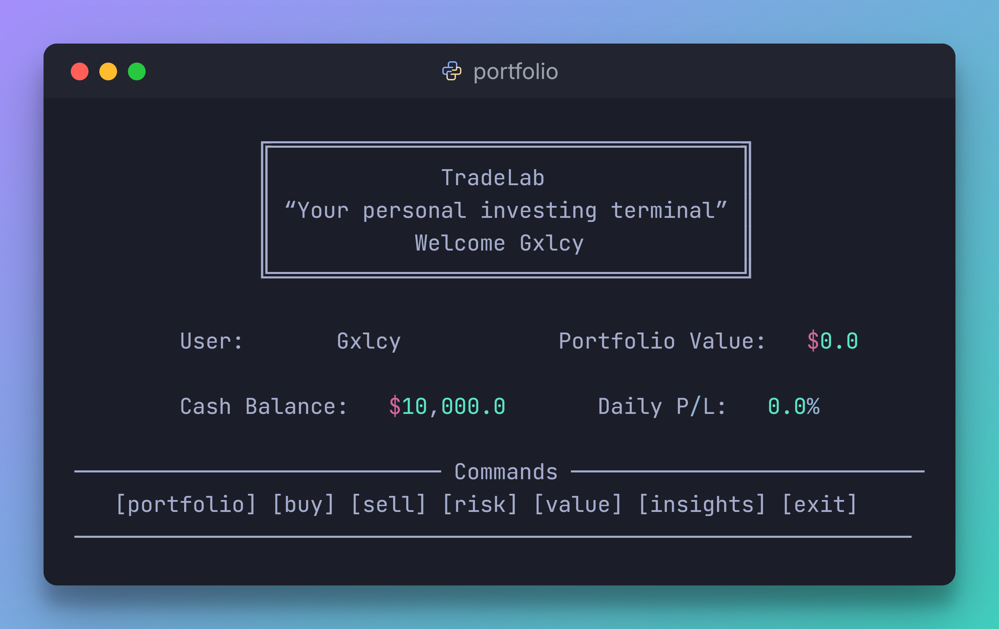
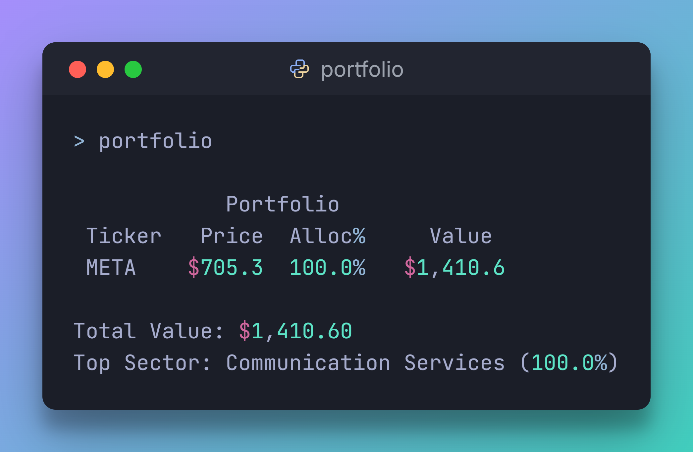
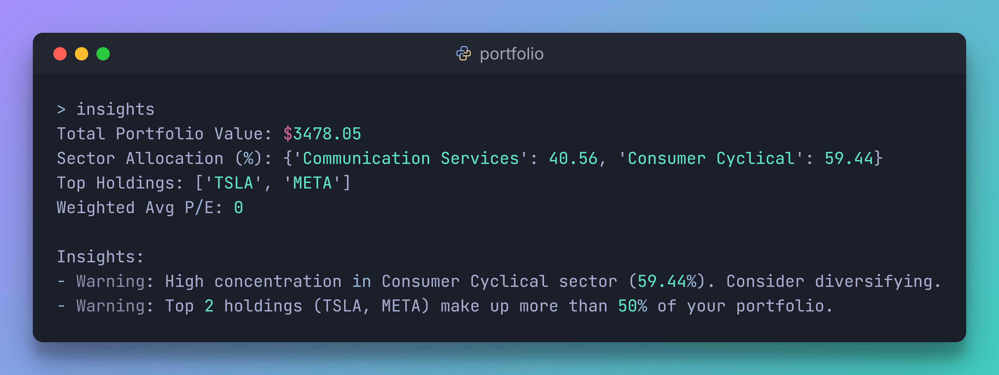

# TradeLab

[](https://www.python.org/)  [](LICENSE)  

**TradeLab** is a terminal-based trading simulator designed for beginners and aspiring investors. Practice buying and selling stocks, track your virtual portfolio, analyze risk, and gain actionable insights — all within a professional CLI environment. Perfect for learning how to trade without risking real money.

---







---

## **Features**
- 💹 **Simulated Trading:** Buy and sell stocks using virtual funds with live prices.  
- 📊 **Portfolio Tracking:** Monitor your holdings and portfolio value in real-time.  
- ⚖️ **Risk & Diversification:** Analyze portfolio beta, volatility, and sector allocation.  
- 🧠 **Smart Insights:** Get actionable advice and warnings about concentration, valuation, and risk.  
- 👤 **Multi-User Support** Create and switch between different accounts.
- 🎨 **Professional CLI Interface:** Color-coded tables, separators for a clean, hacker-style look.  
- 🏫 **Learn to Trade:** Experiment safely and develop trading skills with real market data.

---

## **Installation**

1. **Clone the repository**
```bash
git clone https://github.com/Gxlcyy/TradeLab.git
cd TradeLab
```
2. **Install dependencies**
```bash
pip install -r requirements.txt
```
3. **Run the CLI**
```bash
python src/main.py
```

## **Project Structure**
```bash
TradeLab/
├── data/                  # JSON files
├── src/                   # Source code
│   ├── main.py            # Entry point
│   ├── analytics.py       # Risk, valuation, and metrics
│   ├── insights.py        # Rule-based insights engine
│   ├── utils.py           # Basic functions
│   ├── price_fetcher.py   # Cache prices
│   └── storage.py         # Load/Save functions
├── requirements.txt       # Python dependencies
├── README.md
└── LICENSE